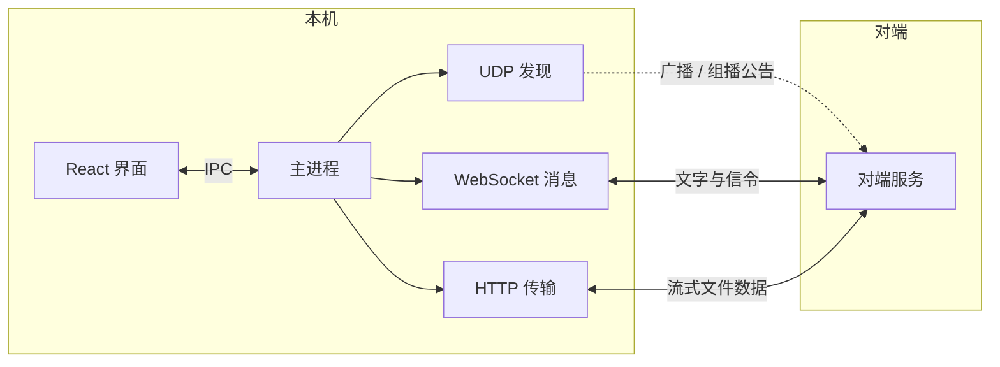

# 局域网通信软件 · LanComm

[](https://github.com/944390394/LanComm/actions/workflows/ci.yml)
[](LICENSE)
[](#环境要求)

局域网内两台 Windows 电脑互传文件、图片和消息的桌面工具。开着就能互相发现，不需要注册、不经过服务器、不上传云端。

给需要在自己几台电脑之间随手扔文件的人用。

## 功能

- **自动发现**：UDP 广播 + 组播，发现不到时自动回退到子网 HTTP 扫描
- **IP 直连**：手动输入对方 IP 建立会话，应对组播被交换机拦截的网络
- **即时消息**：WebSocket 文字消息，带真实送达回执，未送达可一键重发
- **文件与图片**：单请求流式传输，带进度、速度、剩余时间，可随时取消
- **接收确认**：陌生设备发文件时先询问，标记为信任后自动接收
- **文件列表**：按会话查看收发记录，可打开文件或定位到所在文件夹
- **托盘常驻**：关闭窗口最小化到托盘，可设置开机自启
- **消息提醒**：未读红点、系统通知
- **本地留存**：聊天与传输记录保存在本地，重启不丢

## 安装

到 [Releases](../../releases) 下载：

- `LanComm-Setup-x.y.z-x64.exe` — 安装版
- `LanComm-Portable-x.y.z-x64.exe` — 便携版，双击即用

两台电脑都要装，且**必须是同一版本**：握手校验和传输协议是双端配套的，跨版本连不上。

## 使用

1. 两台电脑都启动程序，保持在同一局域网
2. 左侧会自动出现对方设备，点击进入会话；发现不到时用「IP 直连」输入对方 IP
3. 发送文字、拖入文件或图片、粘贴截图，或点「剪贴板」直接发送剪贴板内容
4. 接收的文件默认保存在「下载 / 局域网通信软件」，可在设置里更改

首次运行时 Windows 防火墙会弹窗，请勾选**专用网络**并允许访问。需要放行：

| 端口 | 协议 | 用途 |
| --- | --- | --- |
| 41234 | UDP | 设备发现 |
| 17890 | TCP | 文件传输 |
| 17891 | TCP | 即时消息 |

端口被占用时程序会自动顺延到下一个可用端口，也可以在设置里手动指定。

如果两台设备互相看不见，依次检查：是否在同一网段、是否连的是开启了「客户端隔离」的访客 Wi‑Fi、防火墙是否放行。都正常仍然发现不了的话，用 IP 直连。

## 工作原理



发现层每 2 秒向广播地址和组播组发一次公告，超时未收到心跳的设备标记为离线。UDP 被网络环境拦截时，会退化为扫描本网段的 `/identity` 接口，找到设备后停止扫描以免持续占用带宽。

消息层在本机监听 WebSocket，负责文字消息和传输信令。文件走独立的 HTTP 服务，整个文件作为单个流式请求发送。

## 安全

局域网被视为不可信环境。浏览器可以向任意内网地址发起 WebSocket 连接且不受同源策略约束，因此程序会拒绝携带 `Origin` 的握手、要求浏览器无法设置的自定义请求头，并且不返回任何 CORS 响应头。文件上传只接受已确认的传输 ID，且来源 IP 必须与发起方一致。

**传输内容是明文的**，同一局域网内有能力抓包的人可以看到内容，不要用它传敏感资料。完整的威胁模型和已知限制见 [SECURITY.md](SECURITY.md)。

## 开发

需要 Node.js 20 以上。

```bash
npm install
npm run dev          # 开发环境
npm run typecheck    # 类型检查
npm run lint         # ESLint
npm run format       # Prettier
```

打包 Windows 安装包：

```bash
npm run dist
```

产物在 `release/`。国内网络建议先设置镜像：

```bash
set ELECTRON_MIRROR=https://npmmirror.com/mirrors/electron/
set ELECTRON_BUILDER_BINARIES_MIRROR=https://npmmirror.com/mirrors/electron-builder-binaries/
```

### 项目结构

```
src/
  main/           主进程：发现、消息、传输、设置、托盘
    discovery.ts    UDP 发现与子网扫描
    hub.ts          WebSocket 服务与会话状态
    transfer.ts     HTTP 传输服务
    validate.ts     报文校验
    store.ts        配置持久化
    history.ts      聊天与传输记录持久化
  preload/        contextBridge 暴露的 IPC 接口
  renderer/       React 界面
  shared/         双端共用的类型与协议常量
test/             需要先启动应用的手动验证脚本
```

想参与开发请看 [CONTRIBUTING.md](CONTRIBUTING.md)。

## 技术栈

Electron 34 · React 19 · TypeScript · Tailwind CSS · electron-vite · electron-builder

## 许可证

[MIT](LICENSE)
